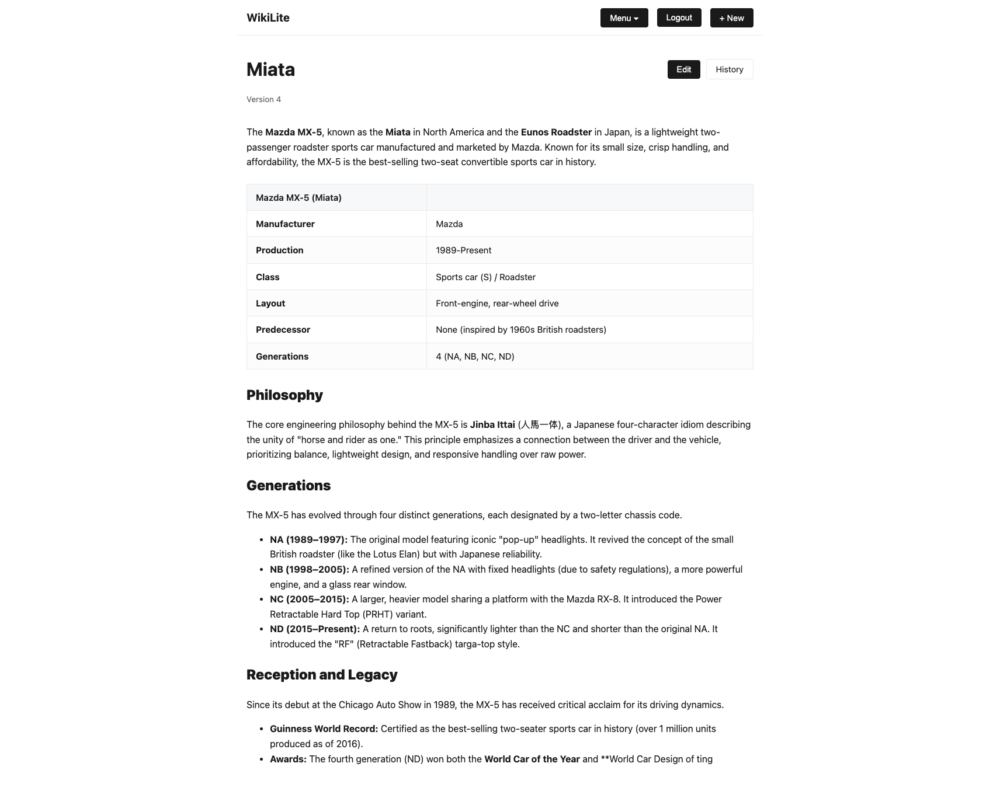

# Example Plugins

These plugins provide examples of what can be accomplished with the plugin
system.

## Plugins

- `toc.js` adds a table of contents to the page.
- `reading-time.js` adds a reading time estimate to the page.
- `comments.js` adds a comments section to the page by leveraging `onAction`
  events to post comments.
- `feedback.js` adds feedback like/dislike buttons to the page.

## Screenshots

- Without plugins: 
- With plugins:
